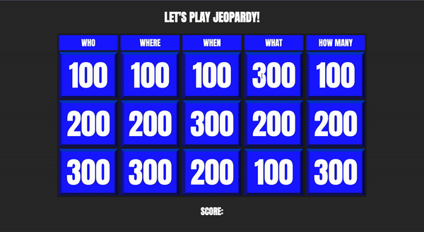

# Jeopardy Game

This is a project in the [Code Two Word Games](https://www.freecodecamp.org/news/javascript-tutorial-code-two-word-games/) course. Coding games is a fun way to improve your JavaScript skills.

## Table of contents 😌

- [Overview](#overview)
  - [The project](#the-project)
  - [Screenshot](#screenshot)
  - [Links](#links)
- [My process](#my-process)
  - [Built with](#built-with)
  - [What I learned](#what-i-learned)
  - [Continued development](#continued-development)
  - [Code snippets](#im-really-proud-of-these-code-snippets%EF%B8%8F)
  - [Useful resources](#useful-resources)
- [Author](#author)
- [Acknowledgments](#acknowledgments)

## Overview👋🏾

Welcome to the Code Your Own Jeopardy Game project of the course!

### The project😥

In this project users will be able to:

- Learn how to build a Jeopardy game.
    - The Jeopardy game has been adapted to work well for one player . You score points by answering questions correctly.

### Screenshot🌇



### Links👩🏾‍💻

- Live Site URL: (https://aquamarine-treacle-a11000.netlify.app/)

## My process💭

This is a complex project that I started by marking out initial structure, classes, and id's in HTML. Next I finalized the UI by styling the CSS. I styled both the front and back of the cards, and the question buttons. I then added functionality by way of JavaScript to switch between create and display the categories, card values, questions, and correct and incorrect answers.

### Built with👷🏾‍♀️

- Semantic HTML5 markup
- CSS custom properties
- Flexbox
- JavaScript

### What I learned👩🏾‍🏫

I learned the logic behind making a functional jeopardy game. 

I also learned how to use the setAttribute() DOM element property.

### Continued development🔮

In the future I plan on accessing an API to make this game even more challenging. STAY TUNED!

I also plan on continuing to practice using loops to cycle through data.

I also plan on continuing to learn the best ways to phrase git commits, so that future viewers can fully understand the changes that have occurred.

### I'm really proud of these code snippets✂️


```js
if (cardOfButton.getAttribute('data-correct') == this.innerHTML) {
        score = score + parseInt(cardOfButton.getAttribute('data-value'))
        scoreDisplay.innerHTML = score
        cardOfButton.classList.add('correct-answer')
        
        setTimeout(() => {
            while (cardOfButton.firstChild) {
                cardOfButton.removeChild(cardOfButton.lastChild)
            }
            cardOfButton.innerHTML = cardOfButton.getAttribute('data-value')
        }, 100)
    } else {
        cardOfButton.classList.add('wrong-answer')
        setTimeout(() => {
            while (cardOfButton.firstChild) {
                cardOfButton.removeChild(cardOfButton.lastChild)
            }
            cardOfButton.innerHTML = 0
        }, 100)
    }
```

### Useful resources📖

- [Resource](https://developer.mozilla.org/en-US/docs/Web/API/Element/setAttribute) - This is an article which helped me understand the setAttribute DOM Element property. I would recommend this to anyone still learning this concept.

## Author🔎

- Website - [Portfolio Site](https://maiannethornton.netlify.app/)
- Frontend Mentor - [@MaianneThornton](https://www.frontendmentor.io/profile/MaianneThornton)
- GitHub - [@MaianneThornton](GitHub.com/MaianneThornton)
- Twitter - [@MaianneThornton](https://twitter.com/MaianneThornton)
- LinkedIn - [@MaianneThornton](https://www.linkedin.com/in/maiannethornton/)

## Acknowledgments🙏🏾

Special Thanks go to [Ania Kubów](https://www.freecodecamp.org/news/author/ania/) and [freeCodeCamp](https://www.freecodecamp.org/) creating the course and making reviewing JavaScript concepts fun 😊.
